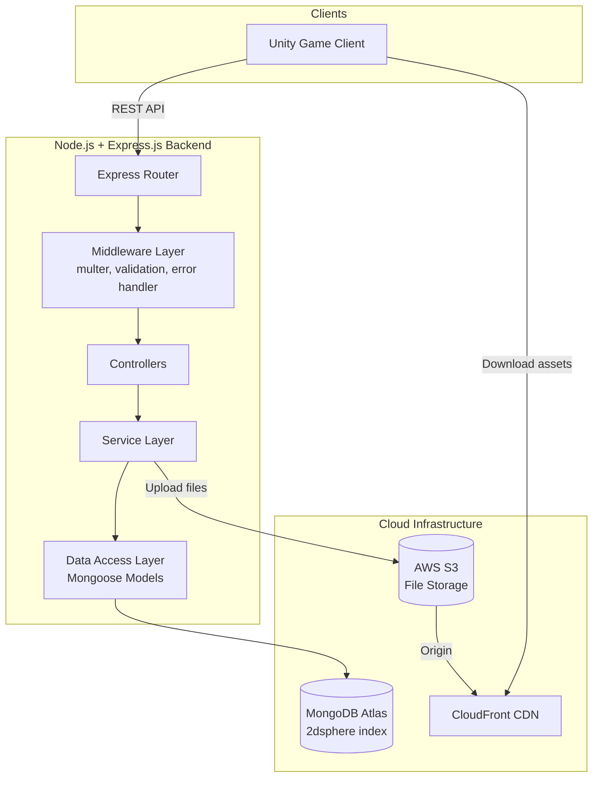
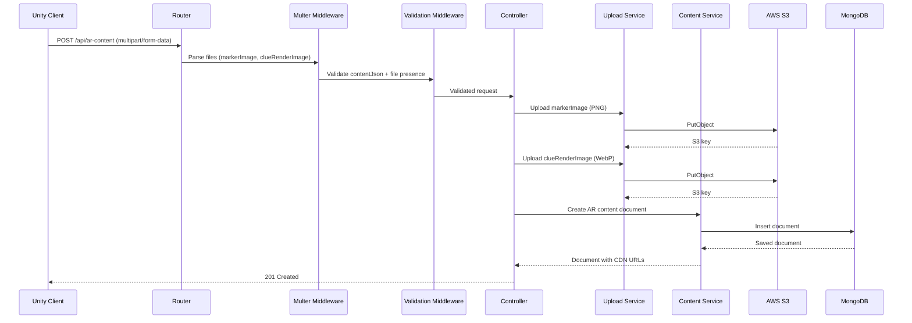

# Design Document: AR Treasure Hunt Backend

## Overview

This design describes the backend architecture for a multiplayer AR Treasure Hunt game. The system is a Node.js + Express.js REST API that handles AR content lifecycle management, geospatial queries, game session persistence, and clue progress tracking.

The backend serves as the data layer between Unity game clients and cloud infrastructure (MongoDB Atlas, AWS S3, CloudFront). It does NOT handle any AR logic — all marker detection, camera pose estimation, and rendering happen client-side.

### Key Design Decisions

1. **Express.js with layered architecture** — Routes → Controllers → Services → Data Access. Keeps concerns separated and testable.
2. **Multer for multipart uploads** — Battle-tested middleware for handling file uploads in Express.
3. **Mongoose ODM** — Provides schema validation, 2dsphere index management, and clean query APIs for MongoDB Atlas.
4. **Soft delete pattern** — AR content is never physically removed; `isDeleted: true` flag excludes it from queries while preserving historical data.
5. **CDN URL construction** — Simple string concatenation of CloudFront domain + S3 key. No signed URLs needed since game assets are public.

## Architecture



### Request Flow: AR Content Creation



### Layered Architecture

| Layer | Responsibility | Testability |
|-------|---------------|-------------|
| Routes | HTTP method + path mapping | Integration tests |
| Middleware | File parsing, validation, error formatting | Unit tests with mocks |
| Controllers | Orchestrate service calls, HTTP response formatting | Unit tests with mocked services |
| Services | Business logic (upload, content CRUD, geospatial, sessions, progress) | Unit + property tests |
| Data Access | Mongoose models, schema definitions, index management | Integration tests |

## Components and Interfaces

### 1. Express Router (`routes/arContent.js`, `routes/gameSession.js`, `routes/clueProgress.js`)

Defines route-to-controller mappings:

```javascript
// routes/arContent.js
router.post('/', upload.fields([...]), validateArContent, arContentController.create);
router.get('/nearby', validateNearbyQuery, arContentController.getNearby);
router.get('/:id', validateObjectId, arContentController.getById);
router.delete('/:id', validateObjectId, arContentController.softDelete);
```

### 2. Middleware

#### Multer Upload Middleware (`middleware/upload.js`)
- Configures multer with memory storage (buffers for S3 upload)
- Accepts fields: `markerImage` (single PNG), `clueRenderImage` (single WebP)

#### Validation Middleware (`middleware/validation.js`)
- `validateArContent` — checks contentJson parseable, required files present, file types valid
- `validateNearbyQuery` — checks lat/lon are valid numbers, radius is positive number
- `validateObjectId` — checks `:id` param is valid MongoDB ObjectId format

#### Error Handler Middleware (`middleware/errorHandler.js`)
- Catches all errors, formats consistent JSON error responses
- Maps known error types to appropriate HTTP status codes

### 3. Controllers

#### ArContentController (`controllers/arContentController.js`)

```typescript
interface ArContentController {
  create(req, res, next): Promise<void>;      // POST /api/ar-content
  getNearby(req, res, next): Promise<void>;   // GET /api/ar-content/nearby
  getById(req, res, next): Promise<void>;     // GET /api/ar-content/:id
  softDelete(req, res, next): Promise<void>;  // DELETE /api/ar-content/:id
}
```

#### GameSessionController (`controllers/gameSessionController.js`)

```typescript
interface GameSessionController {
  start(req, res, next): Promise<void>;       // POST /api/game-session/start
}
```

#### ClueProgressController (`controllers/clueProgressController.js`)

```typescript
interface ClueProgressController {
  create(req, res, next): Promise<void>;      // POST /api/clue-progress
}
```

### 4. Services

#### UploadService (`services/uploadService.js`)

```typescript
interface UploadService {
  uploadFile(buffer: Buffer, key: string, contentType: string): Promise<string>;
  generateS3Key(prefix: string, originalName: string): string;
}
```

- Uploads buffer to S3 using AWS SDK v3
- Returns the S3 object key
- Key format: `{prefix}/{uuid}-{timestamp}.{ext}`

#### CdnUrlGenerator (`services/cdnUrlGenerator.js`)

```typescript
interface CdnUrlGenerator {
  generateUrl(s3Key: string): string;
}
```

- Constructs URL: `https://{CLOUDFRONT_DOMAIN}/{s3Key}`
- Pure function, no side effects

#### ContentService (`services/contentService.js`)

```typescript
interface ContentService {
  create(contentData: object): Promise<ArContentDocument>;
  findNearby(lat: number, lon: number, radiusMeters: number): Promise<ArContentDocument[]>;
  findById(id: string): Promise<ArContentDocument | null>;
  softDelete(id: string): Promise<ArContentDocument | null>;
}
```

- All read queries include `{ isDeleted: false }` filter
- `findNearby` uses `$nearSphere` with `$maxDistance`
- `softDelete` returns null if document not found or already deleted

#### SessionService (`services/sessionService.js`)

```typescript
interface SessionService {
  createSession(playerInfo: object): Promise<GameSessionDocument>;
}
```

#### ProgressService (`services/progressService.js`)

```typescript
interface ProgressService {
  recordProgress(sessionId: string, playerId: string, clueId: string): Promise<ClueProgressDocument>;
}
```

- Validates sessionId references existing session
- Validates clueId references existing (non-deleted) AR content

### 5. Data Access Layer (Mongoose Models)

Models are defined in `models/` directory and encapsulate schema definitions, indexes, and any static/instance methods.

## Data Models

### AR Content Document (`models/ArContent.js`)

```javascript
const arContentSchema = new Schema({
  // Geospatial location (GeoJSON Point)
  location: {
    type: { type: String, enum: ['Point'], required: true },
    coordinates: { type: [Number], required: true } // [longitude, latitude]
  },

  // AR transform data
  localOffsetPosition: {
    x: { type: Number, required: true },
    y: { type: Number, required: true },
    z: { type: Number, required: true }
  },
  localOffsetRotationEuler: {
    x: { type: Number, required: true },
    y: { type: Number, required: true },
    z: { type: Number, required: true }
  },
  localScale: {
    x: { type: Number, required: true },
    y: { type: Number, required: true },
    z: { type: Number, required: true }
  },

  // World position and rotation
  worldPosition: {
    x: { type: Number, required: true },
    y: { type: Number, required: true },
    z: { type: Number, required: true }
  },
  worldRotation: {
    x: { type: Number, required: true },
    y: { type: Number, required: true },
    z: { type: Number, required: true },
    w: { type: Number, required: true }
  },

  // Marker anchor data
  markerLocalOffset: {
    x: { type: Number, required: true },
    y: { type: Number, required: true },
    z: { type: Number, required: true }
  },

  // CDN asset URLs
  markerImageUrl: { type: String, required: true },
  clueRenderImageUrl: { type: String, required: true },

  // Soft delete flag
  isDeleted: { type: Boolean, default: false },

  // Additional metadata from contentJson (flexible)
  metadata: { type: Schema.Types.Mixed }
}, {
  timestamps: true // createdAt, updatedAt
});

// 2dsphere index for geospatial queries
arContentSchema.index({ location: '2dsphere' });

// Compound index for efficient filtered queries
arContentSchema.index({ isDeleted: 1, location: '2dsphere' });
```

### Game Session Document (`models/GameSession.js`)

```javascript
const gameSessionSchema = new Schema({
  playerId: { type: String, required: true },
  playerName: { type: String, required: true },
  startedAt: { type: Date, default: Date.now },
  status: { type: String, enum: ['active', 'completed', 'abandoned'], default: 'active' }
}, {
  timestamps: true
});
```

### Clue Progress Document (`models/ClueProgress.js`)

```javascript
const clueProgressSchema = new Schema({
  sessionId: { type: Schema.Types.ObjectId, ref: 'GameSession', required: true },
  playerId: { type: String, required: true },
  clueId: { type: Schema.Types.ObjectId, ref: 'ArContent', required: true },
  collectedAt: { type: Date, default: Date.now }
}, {
  timestamps: true
});

// Prevent duplicate progress entries
clueProgressSchema.index({ sessionId: 1, playerId: 1, clueId: 1 }, { unique: true });
```

### Environment Configuration

| Variable | Description |
|----------|-------------|
| `PORT` | Server port (default: 3000) |
| `MONGODB_URI` | MongoDB Atlas connection string |
| `AWS_REGION` | AWS region for S3 |
| `AWS_S3_BUCKET` | S3 bucket name |
| `AWS_ACCESS_KEY_ID` | AWS credentials |
| `AWS_SECRET_ACCESS_KEY` | AWS credentials |
| `CLOUDFRONT_DOMAIN` | CloudFront distribution domain |

## Correctness Properties

*A property is a characteristic or behavior that should hold true across all valid executions of a system — essentially, a formal statement about what the system should do. Properties serve as the bridge between human-readable specifications and machine-verifiable correctness guarantees.*

### Property 1: Content JSON round-trip preservation

*For any* valid AR content object, serializing it to a JSON string, parsing it back, storing it in MongoDB, and retrieving it SHALL produce an object with equivalent field values for all AR-relevant fields (location, transforms, URLs, metadata).

**Validates: Requirements 10.4, 1.1**

### Property 2: CDN URL generation correctness

*For any* S3 object key, the CDN URL Generator SHALL produce a URL that starts with the configured CloudFront domain prefix and ends with the exact S3 key, with no mutation of the key.

**Validates: Requirements 1.4, 9.2**

### Property 3: Soft-delete exclusion invariant

*For any* AR content document where isDeleted is true, no read query (nearby search or single retrieval by ID) SHALL return that document in its results.

**Validates: Requirements 2.2, 3.2**

### Property 4: Soft-delete idempotence

*For any* AR content document, after a successful soft-delete operation sets isDeleted to true, any subsequent soft-delete attempt on the same document SHALL return a 404 not-found response.

**Validates: Requirements 4.1, 4.5**

### Property 5: Nearby query parameter validation

*For any* request to the nearby endpoint where lat is not a valid number, lon is not a valid number, or radius is not a valid positive number, the system SHALL reject the request with HTTP 400.

**Validates: Requirements 2.5, 2.6, 2.7**

### Property 6: ObjectId format validation

*For any* string that is not a valid 24-character hexadecimal MongoDB ObjectId, requests to endpoints accepting an `:id` parameter SHALL return HTTP 400.

**Validates: Requirements 3.5, 4.4**

### Property 7: Invalid JSON rejection

*For any* string that is not valid JSON, when submitted as the contentJson field, the system SHALL reject the request with HTTP 400.

**Validates: Requirements 1.7, 10.3**

### Property 8: File type validation

*For any* buffer whose first bytes do not match the PNG magic number (89 50 4E 47) when submitted as markerImage, or do not match the WebP signature (52 49 46 46 ... 57 45 42 50) when submitted as clueRenderImage, the system SHALL reject the request with HTTP 400.

**Validates: Requirements 9.5, 9.6**

### Property 9: S3 key uniqueness

*For any* sequence of file uploads with arbitrary original filenames (including duplicates), all generated S3 keys SHALL be unique.

**Validates: Requirements 9.1**

### Property 10: GeoJSON Point format storage

*For any* valid latitude and longitude pair, the stored location field SHALL be a GeoJSON Point object with type "Point" and coordinates in [longitude, latitude] order.

**Validates: Requirements 7.2, 8.1**

### Property 11: AR content document schema completeness

*For any* valid AR content creation request, the stored document SHALL contain all required fields: location (GeoJSON Point), localOffsetPosition, localOffsetRotationEuler, localScale, worldPosition, worldRotation, markerLocalOffset, markerImageUrl, clueRenderImageUrl, isDeleted (false), createdAt, and updatedAt.

**Validates: Requirements 8.2, 8.3, 8.4, 8.5, 8.6, 8.7**

### Property 12: Geospatial query returns only nearby results

*For any* center point and radius, all documents returned by the nearby query SHALL have a location within the specified radius (in meters) from the center point.

**Validates: Requirements 2.1**

### Property 13: Document creation timestamps

*For any* successfully created document (Game Session or Clue Progress), the document SHALL contain a valid timestamp field (startedAt or collectedAt respectively) that is not in the future relative to the response time.

**Validates: Requirements 5.3, 6.3**

### Property 14: Required field validation for session and progress

*For any* request body missing one or more required fields (playerId/playerName for sessions; sessionId/playerId/clueId for progress), the system SHALL reject the request with HTTP 400.

**Validates: Requirements 5.4, 6.6**

## Error Handling

### Error Response Format

All error responses follow a consistent JSON structure:

```json
{
  "error": {
    "code": "VALIDATION_ERROR",
    "message": "Human-readable description of what went wrong",
    "details": {}  // Optional: field-level validation errors
  }
}
```

### Error Categories and HTTP Status Codes

| Status | Code | Trigger |
|--------|------|---------|
| 400 | `VALIDATION_ERROR` | Missing/invalid fields, bad JSON, invalid ObjectId, wrong file type |
| 404 | `NOT_FOUND` | Document doesn't exist or is soft-deleted |
| 500 | `UPLOAD_ERROR` | S3 upload failure |
| 500 | `DATABASE_ERROR` | MongoDB connection/query failure |
| 500 | `INTERNAL_ERROR` | Unexpected server errors |

### Error Handling Strategy

1. **Validation errors** — Caught in validation middleware before reaching controllers. Return 400 immediately with specific field errors.
2. **S3 failures** — Caught in UploadService. If one file uploads but the second fails, no rollback of the first (eventual consistency acceptable for game assets). Return 500.
3. **MongoDB failures** — Caught in service layer. Connection errors and query failures return 500.
4. **Unhandled errors** — Global error handler middleware catches anything that falls through. Logs full error, returns generic 500 to client.

### Validation Rules

| Field | Rules |
|-------|-------|
| `contentJson` | Must be valid JSON string or object |
| `markerImage` | Must be present, must have PNG magic bytes |
| `clueRenderImage` | Must be present, must have WebP signature |
| `lat` | Must be a number between -90 and 90 |
| `lon` | Must be a number between -180 and 180 |
| `radius` | Must be a positive number (meters) |
| `:id` | Must be a valid 24-char hex string (MongoDB ObjectId) |
| `playerId` | Must be a non-empty string |
| `playerName` | Must be a non-empty string |
| `sessionId` | Must be a valid ObjectId referencing existing session |
| `clueId` | Must be a valid ObjectId referencing existing AR content |

## Testing Strategy

### Testing Framework

- **Test runner**: Jest
- **HTTP testing**: Supertest (for integration tests)
- **Property-based testing**: fast-check
- **Mocking**: Jest built-in mocks for S3, MongoDB

### Test Layers

#### 1. Property-Based Tests (fast-check)

Each correctness property from the design document is implemented as a property-based test with minimum 100 iterations. These test the pure logic and invariants of the system.

**Configuration:**
- Minimum 100 iterations per property
- Each test tagged with: `Feature: ar-treasure-hunt-backend, Property {N}: {title}`

**Target modules:**
- `cdnUrlGenerator` — Property 2 (URL generation correctness)
- `contentService` — Properties 1, 3, 4, 10, 11, 12 (with mocked MongoDB)
- `uploadService` — Property 9 (key uniqueness)
- Validation middleware — Properties 5, 6, 7, 8, 14
- `sessionService` / `progressService` — Property 13

#### 2. Unit Tests (Jest)

Example-based tests for specific scenarios:
- Successful content creation returns 201
- Successful retrieval returns 200
- S3 failure returns 500
- Pre-parsed contentJson object used directly
- PNG file accepted, WebP file accepted
- Referential integrity checks (invalid sessionId → 404, invalid clueId → 404)

#### 3. Integration Tests (Supertest + MongoDB Memory Server)

End-to-end API tests with real MongoDB (in-memory):
- Full content creation flow (upload → store → retrieve)
- Geospatial query with real 2dsphere index
- Game session + progress tracking flow
- Soft-delete then verify exclusion from queries

### Test File Structure

```
tests/
├── properties/           # Property-based tests
│   ├── cdnUrl.property.test.js
│   ├── contentRoundTrip.property.test.js
│   ├── softDelete.property.test.js
│   ├── geospatial.property.test.js
│   ├── validation.property.test.js
│   ├── s3KeyUniqueness.property.test.js
│   ├── schema.property.test.js
│   └── timestamps.property.test.js
├── unit/                 # Example-based unit tests
│   ├── arContentController.test.js
│   ├── gameSessionController.test.js
│   ├── clueProgressController.test.js
│   ├── uploadService.test.js
│   └── validation.test.js
└── integration/          # End-to-end API tests
    ├── arContent.integration.test.js
    ├── gameSession.integration.test.js
    └── clueProgress.integration.test.js
```

### Mocking Strategy

| Dependency | Mock Approach |
|-----------|---------------|
| AWS S3 | Jest mock of `@aws-sdk/client-s3` — returns fake keys |
| MongoDB | mongodb-memory-server for integration tests; Jest mock of Mongoose models for unit/property tests |
| CloudFront | No mock needed — CDN URL generation is pure string concatenation |

