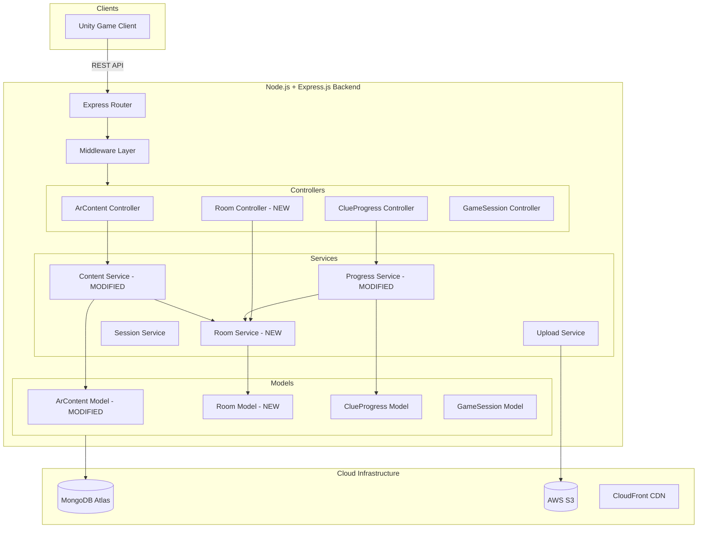
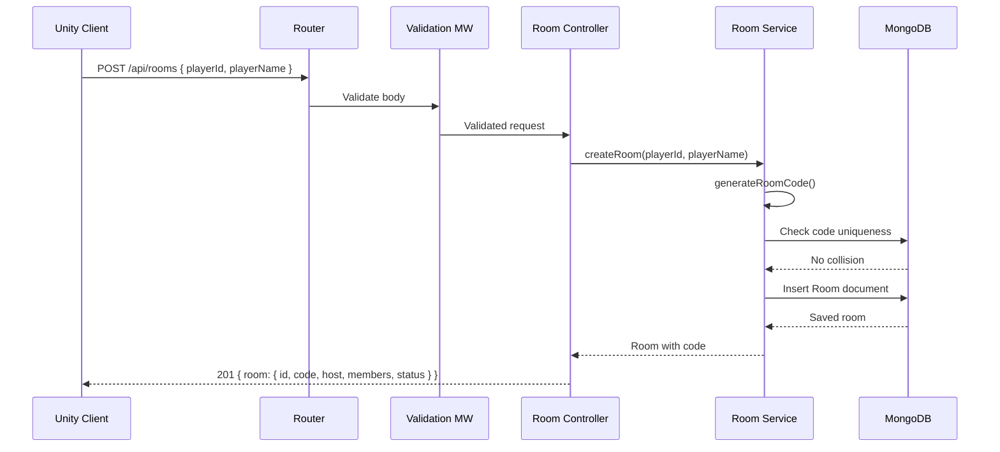
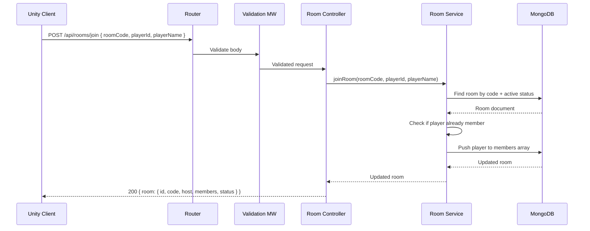
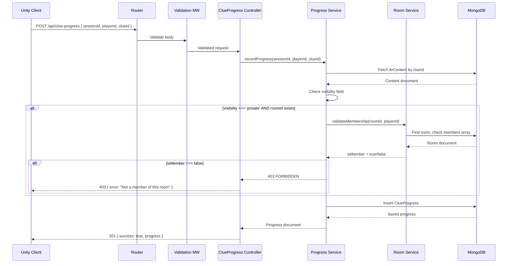
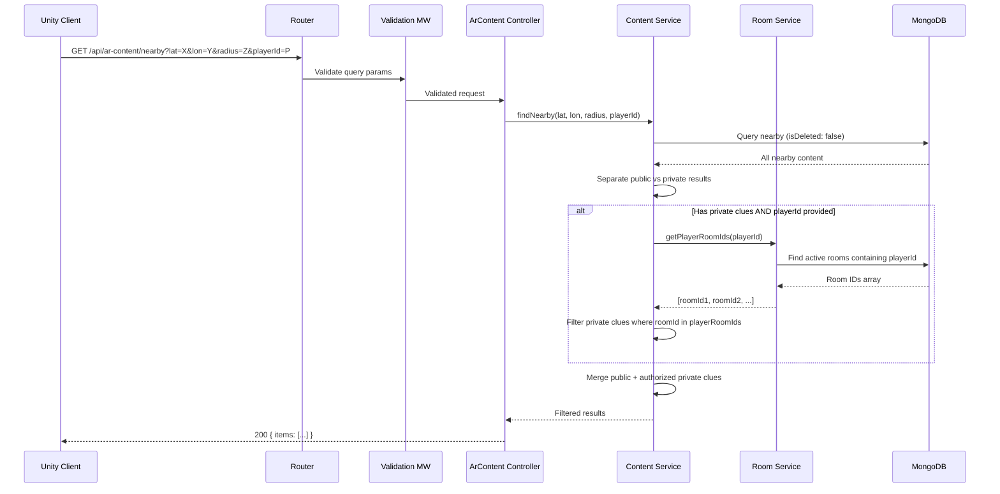

# Design Document: Multiplayer Room Management

## Overview

This design adds multiplayer room management to the existing AR Treasure Hunt backend. Rooms allow players to form groups, share a room code, and access private clues that are linked to their room. The feature integrates into the existing layered architecture (Routes → Middleware → Controllers → Services → Models) without altering existing public clue behavior.

The core additions are: a Room model, a `roomId` field on ArContent, new Room CRUD/join APIs, and membership validation gates on the clue-progress and nearby-query flows for private clues. Public clues remain completely unchanged — no room validation, no new filters.

### Key Design Decisions

1. **Short alphanumeric room codes** — 6-character uppercase codes (A-Z, 0-9 excluding ambiguous characters) for easy verbal sharing between players. Collision-resistant via retry loop with uniqueness check.
2. **Room as first-class entity** — Separate Room model rather than embedding room data in GameSession. Rooms have independent lifecycle (active/closed) and can span multiple sessions.
3. **Additive schema change** — `roomId` added as an optional field on ArContent. Existing documents without `roomId` continue working as public clues.
4. **Membership validation at service layer** — Room membership checks live in `roomService` and are called by `progressService` and `contentService` only for private clues.
5. **No authentication layer** — Consistent with existing architecture, players are identified by `playerId` string. Room membership is tracked via this ID.

## Architecture



### New API Endpoints

| Method | Path | Description |
|--------|------|-------------|
| POST | `/api/rooms` | Create a new room (generates room code) |
| POST | `/api/rooms/join` | Join an existing room via room code |
| GET | `/api/rooms/:roomId` | Get room details (members, linked clues, status) |
| POST | `/api/rooms/:roomId/clues` | Link clues to a room |

### Modified Endpoints

| Method | Path | Change |
|--------|------|--------|
| POST | `/api/clue-progress` | Validates room membership for private clues |
| GET | `/api/ar-content/nearby` | Filters private clues based on room membership |

## Sequence Diagrams

### Create Room Flow



### Join Room Flow



### Collect Private Clue (with membership validation)



### Nearby Query (with room filtering)



## Components and Interfaces

### New Component: Room Controller (`controllers/roomController.js`)

**Purpose**: Handles HTTP requests for room management operations.

```javascript
/**
 * @interface RoomController
 */
const RoomController = {
  /**
   * Creates a new room with the requesting player as host.
   * POST /api/rooms
   * Body: { playerId: string, playerName: string }
   * Response: 201 { success: true, room: RoomDocument }
   */
  create: async (req, res, next) => {},

  /**
   * Joins an existing room via room code.
   * POST /api/rooms/join
   * Body: { roomCode: string, playerId: string, playerName: string }
   * Response: 200 { success: true, room: RoomDocument }
   */
  join: async (req, res, next) => {},

  /**
   * Gets room details including members and linked clues.
   * GET /api/rooms/:roomId
   * Response: 200 { success: true, room: RoomDocument }
   */
  getDetails: async (req, res, next) => {},

  /**
   * Links clue IDs to a room. Only host can link clues.
   * POST /api/rooms/:roomId/clues
   * Body: { playerId: string, clueIds: string[] }
   * Response: 200 { success: true, room: RoomDocument }
   */
  linkClues: async (req, res, next) => {}
};
```

**Responsibilities**:
- Parse and forward request data to Room Service
- Format HTTP responses
- Delegate all business logic to service layer

### New Component: Room Service (`services/roomService.js`)

**Purpose**: Encapsulates all room business logic — creation, joining, membership validation, room code generation.

```javascript
/**
 * @interface RoomService
 */
const RoomService = {
  /**
   * Creates a new room with a unique room code.
   * @param {string} playerId - Host player's ID
   * @param {string} playerName - Host player's display name
   * @returns {Promise<RoomDocument>} The created room
   */
  createRoom: async (playerId, playerName) => {},

  /**
   * Adds a player to an existing active room.
   * @param {string} roomCode - 6-character room code
   * @param {string} playerId - Joining player's ID
   * @param {string} playerName - Joining player's display name
   * @returns {Promise<RoomDocument>} The updated room
   * @throws {NOT_FOUND} If room code doesn't match an active room
   * @throws {ALREADY_MEMBER} If player is already in the room
   */
  joinRoom: async (roomCode, playerId, playerName) => {},

  /**
   * Gets room details by room ID.
   * @param {string} roomId - MongoDB ObjectId of the room
   * @returns {Promise<RoomDocument>} Room with populated clue references
   * @throws {NOT_FOUND} If room doesn't exist
   */
  getRoomDetails: async (roomId) => {},

  /**
   * Links clue IDs to a room and sets roomId on each ArContent document.
   * @param {string} roomId - MongoDB ObjectId of the room
   * @param {string} playerId - Requesting player's ID (must be host)
   * @param {string[]} clueIds - Array of ArContent ObjectIds to link
   * @returns {Promise<RoomDocument>} Updated room document
   * @throws {FORBIDDEN} If playerId is not the room host
   * @throws {NOT_FOUND} If room or any clueId doesn't exist
   */
  linkClues: async (roomId, playerId, clueIds) => {},

  /**
   * Validates whether a player is a member of a specific room.
   * @param {string} roomId - MongoDB ObjectId of the room
   * @param {string} playerId - Player ID to check
   * @returns {Promise<boolean>} True if player is a member
   */
  validateMembership: async (roomId, playerId) => {},

  /**
   * Gets all active room IDs that a player belongs to.
   * @param {string} playerId - Player ID to look up
   * @returns {Promise<string[]>} Array of room ObjectId strings
   */
  getPlayerRoomIds: async (playerId) => {},

  /**
   * Generates a unique 6-character alphanumeric room code.
   * Retries on collision (max 5 attempts).
   * @returns {Promise<string>} Unique room code
   * @throws {GENERATION_ERROR} If unable to generate unique code after retries
   */
  generateRoomCode: async () => {}
};
```

### Modified Component: Content Service (`services/contentService.js`)

**Changes**: `findNearby` gains an optional `playerId` parameter. When present, private clues are filtered based on the player's room memberships.

```javascript
/**
 * Updated signature for findNearby
 * @param {number} lat - Latitude
 * @param {number} lon - Longitude
 * @param {number} radiusMeters - Search radius
 * @param {string|null} playerId - Optional player ID for room-based filtering
 * @returns {Promise<ArContentDocument[]>} Filtered results
 */
async function findNearby(lat, lon, radiusMeters, playerId = null) {}
```

### Modified Component: Progress Service (`services/progressService.js`)

**Changes**: `recordProgress` now checks if a clue is private and validates room membership before allowing collection.

```javascript
/**
 * Updated recordProgress with room membership validation
 * @param {string} sessionId
 * @param {string} playerId
 * @param {string} clueId
 * @returns {Promise<ClueProgressDocument>}
 * @throws {FORBIDDEN} If clue is private and player is not in the linked room
 */
async function recordProgress(sessionId, playerId, clueId) {}
```

## Data Models

### New Model: Room (`models/Room.js`)

```javascript
const roomSchema = new Schema({
  // Unique short code for sharing
  roomCode: { 
    type: String, 
    required: true, 
    unique: true,
    uppercase: true,
    match: /^[A-Z0-9]{6}$/
  },

  // Room creator
  host: {
    playerId: { type: String, required: true },
    playerName: { type: String, required: true }
  },

  // All players in the room (including host)
  members: [{
    playerId: { type: String, required: true },
    playerName: { type: String, required: true },
    joinedAt: { type: Date, default: Date.now }
  }],

  // Clues linked to this room
  clueIds: [{ type: Schema.Types.ObjectId, ref: 'ArContent' }],

  // Room lifecycle
  status: { 
    type: String, 
    enum: ['active', 'closed'], 
    default: 'active' 
  }
}, {
  timestamps: true // createdAt, updatedAt
});

// Index for fast room code lookups
roomSchema.index({ roomCode: 1, status: 1 });

// Index for finding rooms by player membership
roomSchema.index({ 'members.playerId': 1, status: 1 });
```

### Modified Model: ArContent (`models/ArContent.js`)

**Addition**: Optional `roomId` field linking a clue to a specific room.

```javascript
// Add to existing arContentSchema:
roomId: { 
  type: Schema.Types.ObjectId, 
  ref: 'Room', 
  default: null 
}
```

**Index addition**:
```javascript
// Compound index for room-based queries
arContentSchema.index({ roomId: 1, isDeleted: 1 });
```

### Room Document Example

```json
{
  "_id": "507f1f77bcf86cd799439011",
  "roomCode": "ABC123",
  "host": {
    "playerId": "player-uuid-001",
    "playerName": "Alice"
  },
  "members": [
    {
      "playerId": "player-uuid-001",
      "playerName": "Alice",
      "joinedAt": "2024-01-15T10:00:00Z"
    },
    {
      "playerId": "player-uuid-002",
      "playerName": "Bob",
      "joinedAt": "2024-01-15T10:05:00Z"
    }
  ],
  "clueIds": [
    "507f1f77bcf86cd799439022",
    "507f1f77bcf86cd799439033"
  ],
  "status": "active",
  "createdAt": "2024-01-15T10:00:00Z",
  "updatedAt": "2024-01-15T10:05:00Z"
}
```

## Algorithmic Pseudocode

### Room Code Generation Algorithm

```javascript
/**
 * ALGORITHM: generateRoomCode
 * 
 * Generates a unique 6-character alphanumeric room code.
 * Uses characters that avoid visual ambiguity (no 0/O, 1/I/L).
 * Retries on collision up to MAX_ATTEMPTS.
 */
const CHARSET = 'ABCDEFGHJKMNPQRSTUVWXYZ23456789'; // 30 chars, no 0/O/1/I/L
const CODE_LENGTH = 6;
const MAX_ATTEMPTS = 5;

async function generateRoomCode() {
  for (let attempt = 0; attempt < MAX_ATTEMPTS; attempt++) {
    // Build random code from charset
    let code = '';
    for (let i = 0; i < CODE_LENGTH; i++) {
      const randomIndex = Math.floor(Math.random() * CHARSET.length);
      code += CHARSET[randomIndex];
    }

    // Check uniqueness against active rooms
    const existing = await Room.findOne({ roomCode: code, status: 'active' });
    if (!existing) {
      return code;
    }
    // Collision — retry
  }

  const error = new Error('Unable to generate unique room code after maximum attempts');
  error.code = 'GENERATION_ERROR';
  throw error;
}
```

**Preconditions:**
- MongoDB connection is available
- `Room` model is properly initialized

**Postconditions:**
- Returns a 6-character string from CHARSET
- No active room in the database has the same code
- If unable to generate unique code after MAX_ATTEMPTS, throws GENERATION_ERROR

**Probability analysis:**
- Charset size: 30, Code length: 6 → 30^6 = 729,000,000 possible codes
- Collision probability per attempt with N active rooms: N / 729,000,000
- At 1000 active rooms, collision chance per attempt: ~0.000137%
- 5 consecutive collisions: effectively impossible in practice

### Room Membership Validation Algorithm

```javascript
/**
 * ALGORITHM: validateMembership
 * 
 * Checks whether a player is a member of a specific room.
 * Used by progressService and contentService for private clue access.
 */
async function validateMembership(roomId, playerId) {
  // Precondition: roomId is a valid ObjectId string, playerId is non-empty
  const room = await Room.findOne({
    _id: roomId,
    status: 'active',
    'members.playerId': playerId
  });

  return room !== null;
}
```

**Preconditions:**
- `roomId` is a valid MongoDB ObjectId string
- `playerId` is a non-empty string

**Postconditions:**
- Returns `true` if and only if an active room with the given ID contains a member with the given playerId
- Returns `false` if room doesn't exist, is closed, or player is not a member
- No side effects (read-only operation)

### Private Clue Collection Algorithm

```javascript
/**
 * ALGORITHM: recordProgress (updated)
 * 
 * Records clue progress with room membership gate for private clues.
 * Public clues bypass all room validation.
 */
async function recordProgress(sessionId, playerId, clueId) {
  // Step 1: Validate session exists
  const session = await GameSession.findById(sessionId);
  if (!session) {
    throw createError('Game session not found', 'NOT_FOUND');
  }

  // Step 2: Validate clue exists and is not deleted
  const content = await ArContent.findOne({ _id: clueId, isDeleted: false });
  if (!content) {
    throw createError('AR content clue not found', 'NOT_FOUND');
  }

  // Step 3: Room membership gate (ONLY for private clues with a roomId)
  if (content.visibility === 'private' && content.roomId) {
    const isMember = await roomService.validateMembership(content.roomId, playerId);
    if (!isMember) {
      throw createError('Player is not a member of the room linked to this clue', 'FORBIDDEN');
    }
  }

  // Step 4: Record progress (unchanged)
  const progress = new ClueProgress({ sessionId, playerId, clueId });
  return await progress.save();
}
```

**Preconditions:**
- `sessionId` is a valid ObjectId referencing an existing GameSession
- `playerId` is a non-empty string
- `clueId` is a valid ObjectId referencing a non-deleted ArContent document

**Postconditions:**
- If clue is public (visibility !== 'private' OR roomId is null): progress is recorded without room check
- If clue is private with roomId: progress is recorded only if playerId is a member of the linked room
- If clue is private with roomId and player is NOT a member: throws FORBIDDEN error
- On success: a ClueProgress document is saved with unique compound key (sessionId, playerId, clueId)

**Loop Invariants:** N/A (no loops)

### Nearby Query Filtering Algorithm

```javascript
/**
 * ALGORITHM: findNearby (updated)
 * 
 * Returns nearby clues with room-based filtering for private content.
 * Public clues are always returned. Private clues are returned only if
 * the requesting player is a member of the linked room.
 */
async function findNearby(lat, lon, radiusMeters, playerId = null) {
  // Step 1: Query all nearby non-deleted content
  const allNearby = await ArContent.find({
    isDeleted: false,
    location: {
      $nearSphere: {
        $geometry: { type: 'Point', coordinates: [lon, lat] },
        $maxDistance: radiusMeters
      }
    }
  });

  // Step 2: If no playerId provided, return only public clues
  if (!playerId) {
    return allNearby.filter(item => item.visibility !== 'private' || !item.roomId);
  }

  // Step 3: Get all room IDs the player belongs to
  const playerRoomIds = await roomService.getPlayerRoomIds(playerId);
  const roomIdSet = new Set(playerRoomIds.map(id => id.toString()));

  // Step 4: Filter results
  return allNearby.filter(item => {
    // Public clues or clues without roomId — always included
    if (item.visibility !== 'private' || !item.roomId) {
      return true;
    }
    // Private clues with roomId — include only if player is in that room
    return roomIdSet.has(item.roomId.toString());
  });
}
```

**Preconditions:**
- `lat` is a number in [-90, 90]
- `lon` is a number in [-180, 180]
- `radiusMeters` is a positive number
- `playerId` is null or a non-empty string

**Postconditions:**
- All returned documents are within `radiusMeters` of the query point
- All returned documents have `isDeleted: false`
- Public clues (visibility !== 'private' or no roomId) are always included regardless of playerId
- Private clues with roomId are included only if playerId is a member of that room
- If playerId is null, no private room-linked clues are returned

**Loop Invariants:**
- For the filter loop: each item is independently evaluated — public items always pass, private items pass only with valid membership

### Link Clues to Room Algorithm

```javascript
/**
 * ALGORITHM: linkClues
 * 
 * Links ArContent clues to a room. Sets roomId on each clue document
 * and adds clueIds to the room's clueIds array.
 * Only the room host can perform this operation.
 */
async function linkClues(roomId, playerId, clueIds) {
  // Step 1: Fetch room and verify it exists and is active
  const room = await Room.findOne({ _id: roomId, status: 'active' });
  if (!room) {
    throw createError('Room not found', 'NOT_FOUND');
  }

  // Step 2: Verify requesting player is the host
  if (room.host.playerId !== playerId) {
    throw createError('Only the room host can link clues', 'FORBIDDEN');
  }

  // Step 3: Verify all clueIds reference existing non-deleted content
  const clues = await ArContent.find({ 
    _id: { $in: clueIds }, 
    isDeleted: false 
  });
  if (clues.length !== clueIds.length) {
    throw createError('One or more clue IDs are invalid or deleted', 'NOT_FOUND');
  }

  // Step 4: Set roomId on each clue document
  await ArContent.updateMany(
    { _id: { $in: clueIds } },
    { $set: { roomId: roomId } }
  );

  // Step 5: Add clueIds to room (avoid duplicates)
  const updatedRoom = await Room.findByIdAndUpdate(
    roomId,
    { $addToSet: { clueIds: { $each: clueIds } } },
    { new: true }
  );

  return updatedRoom;
}
```

**Preconditions:**
- `roomId` is a valid ObjectId referencing an active room
- `playerId` matches `room.host.playerId`
- All entries in `clueIds` are valid ObjectIds referencing non-deleted ArContent documents

**Postconditions:**
- Each ArContent document in `clueIds` has `roomId` set to the given room
- The room's `clueIds` array contains all linked clue IDs (no duplicates via `$addToSet`)
- If playerId is not the host: FORBIDDEN error, no mutations
- If any clueId is invalid: NOT_FOUND error, no mutations (check happens before writes)

## Key Functions with Formal Specifications

### Function: createRoom()

```javascript
async function createRoom(playerId, playerName) {
  const roomCode = await generateRoomCode();
  
  const room = new Room({
    roomCode,
    host: { playerId, playerName },
    members: [{ playerId, playerName, joinedAt: new Date() }],
    clueIds: [],
    status: 'active'
  });

  return await room.save();
}
```

**Preconditions:**
- `playerId` is a non-empty string
- `playerName` is a non-empty string

**Postconditions:**
- Returns a saved Room document with a unique 6-character `roomCode`
- `room.host.playerId === playerId`
- `room.members` contains exactly one entry (the host)
- `room.status === 'active'`
- `room.clueIds` is an empty array

### Function: joinRoom()

```javascript
async function joinRoom(roomCode, playerId, playerName) {
  const room = await Room.findOne({ roomCode: roomCode.toUpperCase(), status: 'active' });
  if (!room) {
    throw createError('Room not found or is closed', 'NOT_FOUND');
  }

  // Check if already a member
  const alreadyMember = room.members.some(m => m.playerId === playerId);
  if (alreadyMember) {
    throw createError('Player is already a member of this room', 'ALREADY_MEMBER');
  }

  // Add to members
  room.members.push({ playerId, playerName, joinedAt: new Date() });
  return await room.save();
}
```

**Preconditions:**
- `roomCode` is a non-empty string
- `playerId` is a non-empty string
- `playerName` is a non-empty string

**Postconditions:**
- If room found and player not already a member: player is added to `room.members`, updated room returned
- If room not found or closed: NOT_FOUND error
- If player already a member: ALREADY_MEMBER error
- Room's member count increases by exactly 1 on success
- The host remains unchanged

### Function: getPlayerRoomIds()

```javascript
async function getPlayerRoomIds(playerId) {
  const rooms = await Room.find(
    { 'members.playerId': playerId, status: 'active' },
    { _id: 1 }
  );
  return rooms.map(r => r._id);
}
```

**Preconditions:**
- `playerId` is a non-empty string

**Postconditions:**
- Returns an array of ObjectIds for all active rooms where the player is a member
- Returns empty array if player is in no active rooms
- Only active rooms are included (closed rooms are excluded)
- Read-only operation, no side effects

## Example Usage

```javascript
// Example 1: Host creates a room
const room = await roomService.createRoom('player-001', 'Alice');
// room.roomCode => "HK7M3N"
// room.host => { playerId: 'player-001', playerName: 'Alice' }
// room.members => [{ playerId: 'player-001', playerName: 'Alice', joinedAt: ... }]

// Example 2: Another player joins via room code
const updatedRoom = await roomService.joinRoom('HK7M3N', 'player-002', 'Bob');
// updatedRoom.members.length => 2

// Example 3: Host links private clues to the room
const linkedRoom = await roomService.linkClues(
  room._id.toString(),
  'player-001',
  ['clue-id-1', 'clue-id-2']
);
// ArContent docs now have roomId set
// linkedRoom.clueIds => ['clue-id-1', 'clue-id-2']

// Example 4: Member collects a private clue (succeeds)
const progress = await progressService.recordProgress(
  'session-id', 'player-002', 'clue-id-1'
);
// Works because player-002 is a member of the room

// Example 5: Non-member tries to collect private clue (fails)
try {
  await progressService.recordProgress('session-id', 'player-999', 'clue-id-1');
} catch (err) {
  // err.code === 'FORBIDDEN'
  // err.message === 'Player is not a member of the room linked to this clue'
}

// Example 6: Public clue collection (no room check)
const publicProgress = await progressService.recordProgress(
  'session-id', 'player-999', 'public-clue-id'
);
// Works for any player — no room validation for public clues

// Example 7: Nearby query with room filtering
const nearby = await contentService.findNearby(40.7128, -74.0060, 500, 'player-002');
// Returns: all public clues + private clues from rooms player-002 belongs to
```

## Correctness Properties

### Property 1: Room code uniqueness

*For any* two active rooms in the database, their `roomCode` values SHALL be distinct. No two active rooms can share the same room code.

### Property 2: Room code format invariant

*For any* generated room code, it SHALL be exactly 6 characters long and consist only of characters from the set `ABCDEFGHJKMNPQRSTUVWXYZ23456789`.

### Property 3: Host is always a member

*For any* room, the `host.playerId` SHALL always appear in the `members` array. The host cannot be removed from members while the room exists.

### Property 4: Join idempotence rejection

*For any* player who is already a member of a room, a subsequent join attempt with the same `playerId` and `roomCode` SHALL be rejected with an ALREADY_MEMBER error. The members array SHALL not contain duplicate `playerId` entries.

### Property 5: Public clue bypass

*For any* ArContent document where `visibility !== 'private'` OR `roomId` is null, the clue-progress endpoint SHALL allow collection without any room membership validation, regardless of whether the player is in any room.

### Property 6: Private clue access control

*For any* ArContent document where `visibility === 'private'` AND `roomId` is not null, the clue-progress endpoint SHALL reject collection with FORBIDDEN if the requesting `playerId` is not in the `members` array of the referenced room.

### Property 7: Private clue member access

*For any* ArContent document where `visibility === 'private'` AND `roomId` is not null, if the requesting `playerId` IS in the `members` array of the referenced room, collection SHALL succeed (assuming all other validations pass).

### Property 8: Nearby query public clue preservation

*For any* nearby query, all public clues (visibility !== 'private' or roomId is null) within the radius SHALL be returned regardless of whether a `playerId` is provided or whether that player is in any room.

### Property 9: Nearby query private clue filtering

*For any* nearby query with a `playerId`, private clues with a `roomId` SHALL only be included in results if the player is a member of the referenced room.

### Property 10: Link clues host-only enforcement

*For any* linkClues operation, if the requesting `playerId` does not match `room.host.playerId`, the operation SHALL be rejected with FORBIDDEN and no ArContent documents SHALL be modified.

### Property 11: Link clues sets roomId on content

*For any* successful linkClues operation, every ArContent document in the provided `clueIds` array SHALL have its `roomId` field set to the room's ObjectId.

### Property 12: Room code case insensitivity for joins

*For any* joinRoom operation, the `roomCode` input SHALL be compared case-insensitively. A room created with code "ABC123" SHALL be joinable with input "abc123", "Abc123", or "ABC123".

## Error Handling

### New Error Scenarios

| Status | Code | Trigger |
|--------|------|---------|
| 400 | `VALIDATION_ERROR` | Missing/invalid fields in room requests |
| 403 | `FORBIDDEN` | Non-member accessing private clue, non-host linking clues |
| 404 | `NOT_FOUND` | Room code not found, room ID not found, invalid clue IDs |
| 409 | `ALREADY_MEMBER` | Player trying to join a room they're already in |
| 500 | `GENERATION_ERROR` | Room code generation failed after max retries |

### Error Response Examples

```json
// 403 — Non-member collecting private clue
{
  "error": {
    "code": "FORBIDDEN",
    "message": "Player is not a member of the room linked to this clue"
  }
}

// 404 — Invalid room code
{
  "error": {
    "code": "NOT_FOUND",
    "message": "Room not found or is closed"
  }
}

// 409 — Already a member
{
  "error": {
    "code": "ALREADY_MEMBER",
    "message": "Player is already a member of this room"
  }
}
```

## Testing Strategy

### Unit Testing Approach

- Test `roomService.generateRoomCode` with mocked Room model to simulate collisions
- Test `roomService.joinRoom` with various states (active room, closed room, already member)
- Test `roomService.validateMembership` with member/non-member scenarios
- Test updated `progressService.recordProgress` with public vs private clues
- Test updated `contentService.findNearby` filtering logic

### Property-Based Testing Approach

**Property Test Library**: fast-check (already in project devDependencies)

Key property tests:
1. Room code format: generated codes always match `/^[A-Z0-9]{6}$/` and use only the allowed charset
2. Public clue bypass: for any randomly generated clue with visibility !== 'private', recordProgress never calls validateMembership
3. Membership gate: for any private clue with roomId, if player is not in room, collection is rejected
4. Nearby filtering: public clues in results always equal public clues in DB within radius (unaffected by room state)
5. Host invariant: after any sequence of join operations, host remains in members array

### Integration Testing Approach

- Full room lifecycle: create → join → link clues → collect clues → verify access control
- Verify nearby endpoint returns correct mix of public and private clues
- Verify existing public clue flows are completely unaffected (regression)

### Test File Structure (additions)

```
tests/
├── properties/
│   ├── roomCode.property.test.js         # Properties 1, 2
│   ├── roomMembership.property.test.js   # Properties 3, 4
│   └── roomAccessControl.property.test.js # Properties 5, 6, 7, 8, 9
├── unit/
│   ├── roomController.test.js
│   ├── roomService.test.js
│   └── progressService.room.test.js
└── integration/
    └── room.integration.test.js
```

## Performance Considerations

- **Room code lookup**: Indexed on `{ roomCode: 1, status: 1 }` — O(log n) lookup
- **Membership queries**: Indexed on `{ 'members.playerId': 1, status: 1 }` — efficient for `getPlayerRoomIds`
- **Nearby query overhead**: One additional query to fetch player room IDs when `playerId` is provided. Room count per player expected to be small (< 10), so minimal overhead.
- **Room code generation**: Average case is 1 attempt. With 729M possible codes, collisions are astronomically unlikely under normal load.

## Security Considerations

- **No authentication**: Consistent with existing system. Players self-identify via `playerId`. The system trusts the client-provided ID.
- **Host-only operations**: Only the room host can link clues. Enforced at service layer by comparing `playerId` against `room.host.playerId`.
- **Room code entropy**: 30^6 ≈ 729M possible codes. Brute-forcing an active room code is impractical at this scale.
- **No room enumeration**: No endpoint lists all rooms. Players must know the code to join.

## Dependencies

### Existing (no changes)
- `mongoose` 8.6.3 — ODM for Room model
- `express` 4.21.0 — Router for new endpoints
- `uuid` 10.0.0 — Available for room code generation if needed (not required, using random charset selection)

### New dependencies
- None required. All functionality is achievable with existing packages.
